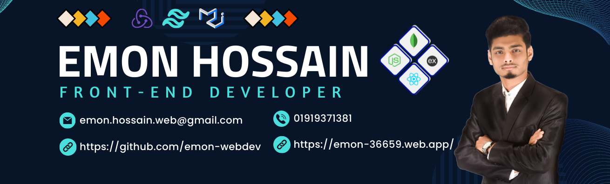

## Hi there my gorgeous friend  I'm Emon Hossain as a Junior Software Developer.

  

<!--####My name is Emon Hossain. Description____.-->

I'm Emon Hossain, a Full Stack Web Application Developer from  Bangladesh.

## 🌐 Socials: Connect with me!

   

## 💻 Tech Stack
### 🌐 Front-End
 
 
 
 
 

   

   
 
 
 
  
### 🌐 Backend-End

 
 
  
 
 
### 🌐 Tools

 
 
 
 
  
 
 
 
  

 
 

## 💻Current Status

  <table class="table w-full">
    <tbody>
      <!-- row 1 -->
      <tr>
         <td>
            
       </td>
        <td>
              
                 
                 
              
       </td>
      </tr>
    </tbody>
  </table>

## 💻 My Projects

  <table class="table w-full">
    <!-- head -->
    <thead>
      <tr>
        <th>List</th>
        <th>Projects Name</th>
        <th>Description</th>
        <th>Website Link</th>
         <th>Client Code Link</th>
         <th>Server Code Link</th>
      </tr>
    </thead>
    <tbody>
      <!-- row 1 -->
      <tr>
        <th>1</th>
        <td>The Cake Stand</td>
        <td>Restaurant Website (MERN-STACK) (Using: ReactJs, Redux-Toolkit, Node, ExpressJs, Mongoose, Tailwind & so many packages)</td>
        <td><a href="https://the-cake-stand.web.app/" target="_blank">Live Link</a></td>
        <td><a href="https://github.com/emon-webdev/the-cake-stand" target="_blank">Client Link</a></td>
        <td><a href="https://github.com/emon-webdev/The-Cake-Stand-Server" target="_blank">Server Link</a></td>
      </tr>
      <tr>
        <th>2</th>
        <td>Capital Trust Bank</td>
        <td>Banking Website (MERN-STACK) (Team Project: Number of team members was 6 people. The duration was seven weeks.)</td>
        <td><a href="https://capital-trust-bank-ee791.web.app/" target="_blank">Live Link</a></td>
        <td><a href="https://github.com/emon-webdev/Capital-Trust-Bank" target="_blank">Client Link</a></td>
        <td><a href="https://github.com/AkashChakrabortty/Capital-Trust-Bank-Server" target="_blank">Server Link</a></td>
      </tr>
      <tr>
        <th>3</th>
        <td>yayfly </td>
        <td>yayfly (using: React.js, Material UI (contribute with another person))</td>
        <td><a href="https://yayfly-app.netlify.app/" target="_blank">Live Link</a></td>
        <td><a href="https://github.com/emon-webdev/yayfly-app" target="_blank">Client Link</a></td>
        <td><a href="just front end" target="_blank">Server Link</a></td>
      </tr>
       <tr>
        <th>2</th>
        <td>Car Showroom</td>
        <td>Car Resell Website (MERN-STACK) (User can) (using: Mern stack Project)</td>
        <td><a href="https://car-resell-web.web.app/" target="_blank">Live Link</a></td>
        <td><a href="https://github.com/emon-webdev/car-showroom" target="_blank">Client Link</a></td>
        <td><a href="https://github.com/emon-webdev/car-showroom-server" target="_blank">Server Link</a></td>
      </tr>
       <tr>
        <th>4</th>
        <td>Cleaning Services</td>
        <td>Cleaning Services (MERN-STACK) (using: Mern stack Project)</td>
        <td><a href="https://cleaning-service-9d61e.web.app/" target="_blank">Live Link</a></td>
        <td><a href="https://github.com/emon-webdev/cleaning-service" target="_blank">Client Link</a></td>
        <td><a href="https://github.com/emon-webdev/cleaning-service-server" target="_blank">Server Link</a></td>
      </tr>
    </tbody>
  </table>

  

- 🔭 I’m currently working on ... react.js / node.js
- 🌱 I’m currently learning ... redux, next.js
- 👯 I’m looking to collaborate on ...
- 🤔 I’m looking for help with ...
- 💬 Ask me about ...
- 📫 How to reach me: ...
- 😄 Pronouns: ...
- ⚡ Fun fact: ...
 
 
 

  You wanna know more about me?

 

#### ?

#### Github Stats

<h2>❤️ Thank you very much! ❤️</h2>
